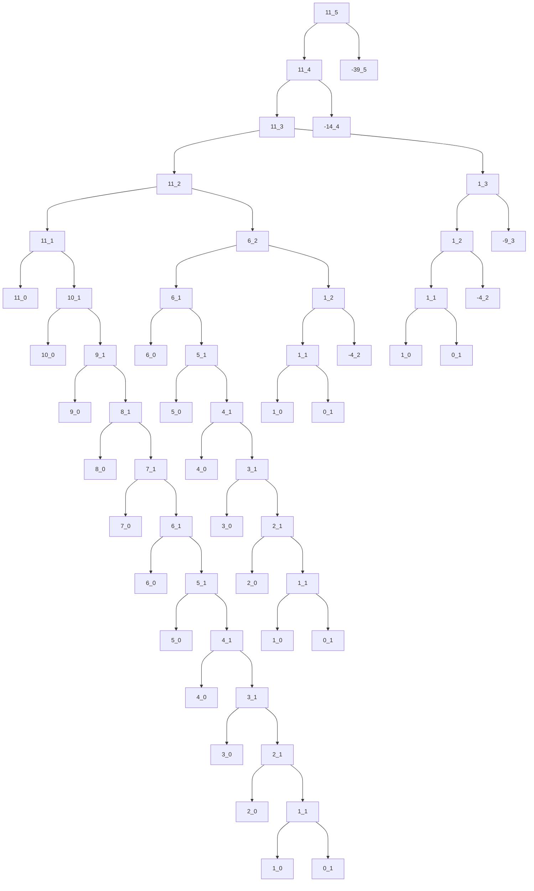
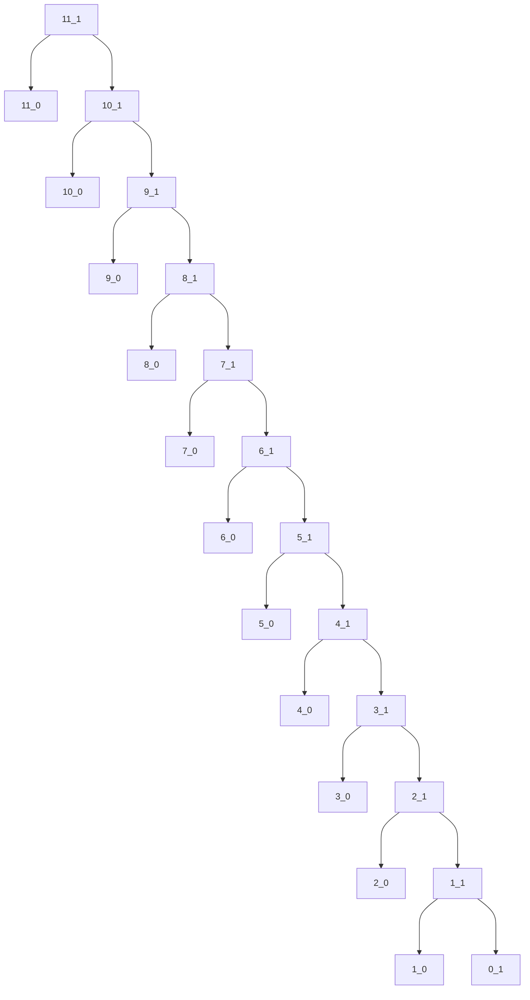
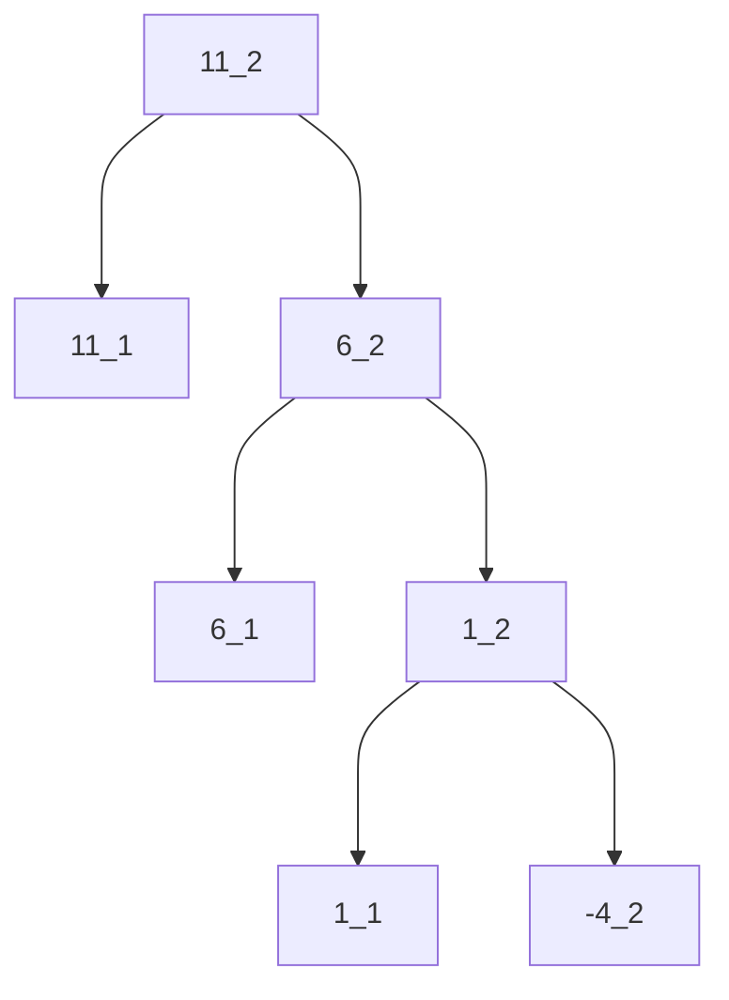

※VS Code の Markdown Preview Enhanced で表示してください．

---

`cc`の各呼び出しを，`[amount]_[kinds-of-coins]`という引数のペアで表す．

`cc 11 5`は以下のようなプロセスを生成する

---

空間計算量について，プロセスツリーの深さで見積もる．これは，`amount`を$n$とすると$\Theta(n)$である．プロセスツリーの深さは，`amount + コインの枚数`となっている

---

時間計算量について，cc の呼び出し回数で見積もる．これは，`amount`を$n$とすると$\Theta(n^5)$である．

`kinds-of-coins`ごとに分類して，プロセスツリーを観察する．

`kinds-of-coins`が 0 の場合，追加の`cc`の呼び出しは無い．したがって，`kinds-of-coins`が 0 となった時点で，以降の計算量は$\Theta(1)$である．

`kinds-of-coins`が 1 の場合，以降の計算量は，その時点での`amount`を$n$とすると$\Theta(n)$となる．これは，対応するツリーを観察することで自明である．例えば，

をみると，`cc`の呼び出し回数は`2 * amount + 1`となっているのがわかる．

`kinds-of-coins`が 2 の場合，以降の計算量は，その時点での`amount`を$n$とすると$\Theta(n^2)$となる．これは，`kinds-of-coins`が 2 のプロセスが，`kinds-of-coins`が 1 のプロセスを$n/5$個生成することからわかる．

`kinds-of-coins`が 1 のプロセス以降は，計算量が$\Theta(n)$であるため，全体としては$\Theta(n^2)$の計算量となる．

同様の議論によって，

`kinds-of-coins`が 3 の場合，以降の計算量は$\Theta(n^3)$となり，

`kinds-of-coins`が 4 の場合，以降の計算量は$\Theta(n^4)$となり，

`kinds-of-coins`が 5 の場合，以降の計算量は$\Theta(n^5)$となる．

この解答は以下のサイトを参考にした．より詳しい説明もここにある

https://sicp-solutions.net/post/sicp-solution-exercise-1-14/
