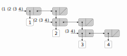
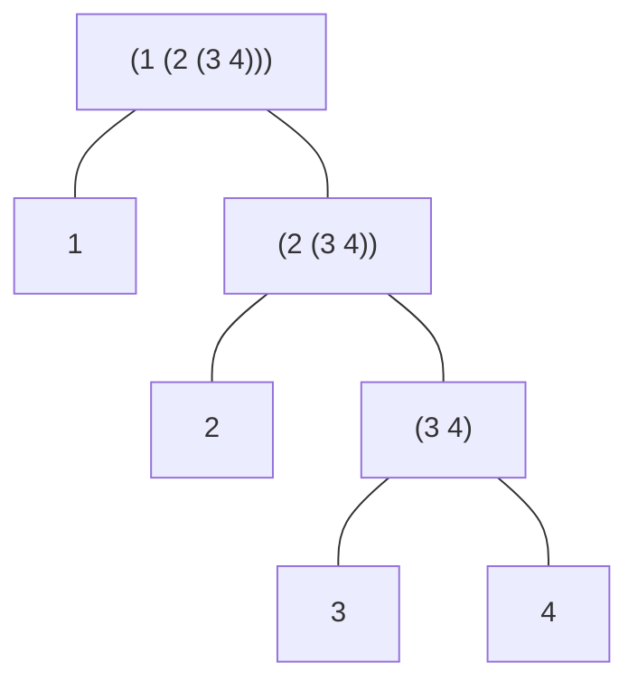

式：`(list 1 (list 2 (list 3 4)))`

インタプリタによる評価結果：

```scheme
(1 (2 (3 4)))
```

これは以下の評価と同じ：

```scheme
(cons
  1
  (cons
    (cons 2
          (cons
            (cons 3
                  (cons
                    4
                    null
                  )
            )
            null
          )
    )
    null
  )
)
```

箱-点構造：



メモ：この SVG は Inkscape 1.2 で編集できる

木構造としての図：


