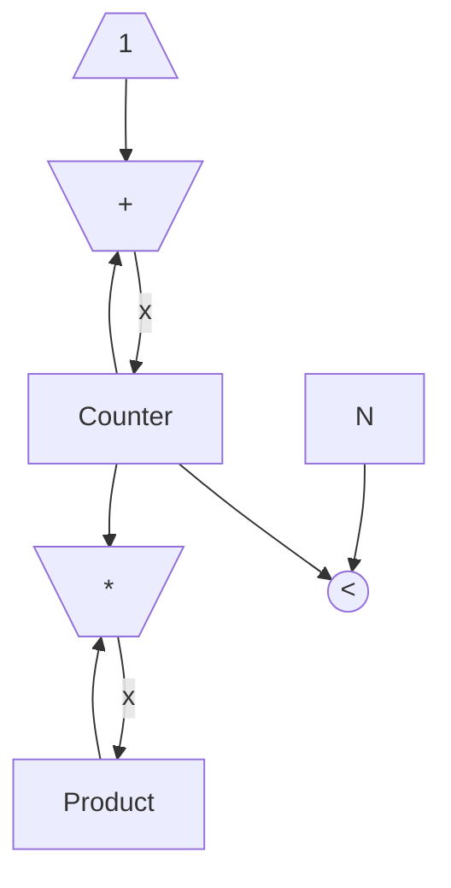
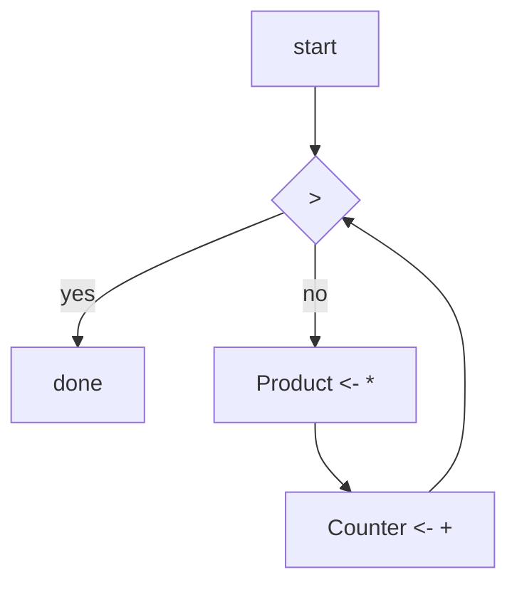

データパス図：

```mermaid
flowchart TB
  Constan1[/1\]
  RegisterCounter[Counter]
  RegisterProduct[Product]
  RegisterN[N]
  OperationPlus[\+/]
  OperationProduct[\*/]
  OperationMoreThan((<))

  RegisterN --> OperationMoreThan
  RegisterCounter --> OperationMoreThan

  RegisterCounter --> OperationPlus
  Constan1 --> OperationPlus
  OperationPlus -- x --> RegisterCounter

  RegisterCounter --> OperationProduct
  RegisterProduct --> OperationProduct
  OperationProduct -- x --> RegisterProduct
```

コントローラ図：

```mermaid
flowchart TB
  start
  MoreThan{>}
  done
  ComputeProduct[Product <- *]
  ComputePlus[Counter <- +]

  start --> MoreThan
  MoreThan -- yes --> done
  MoreThan -- no --> ComputeProduct
  ComputeProduct --> ComputePlus
  ComputePlus --> MoreThan
```
