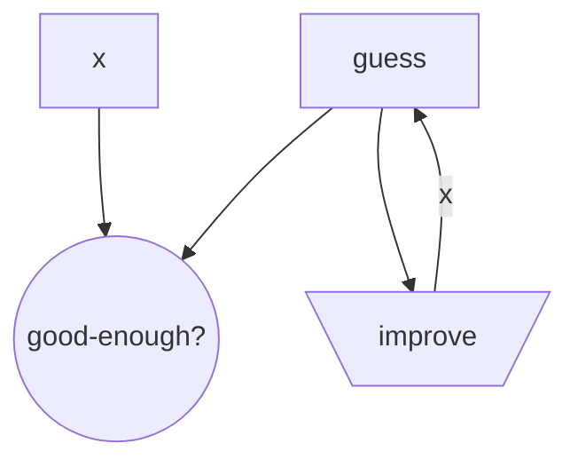
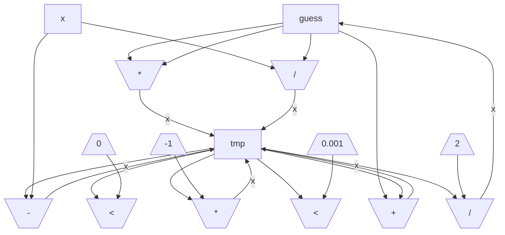

`good-enough?`と`improve`が基本命令として使えるとき：

```mermaid
flowchart TD
  RegGuess[guess]
  RegX[x]
  OpGoodEnough((good-enough?))
  OpImprove[\improve/]

  RegGuess --> OpGoodEnough
  RegX --> OpGoodEnough

  RegGuess --> OpImprove
  OpImprove -- x --> RegGuess
```

`good-enough?`と`improve`を算術演算によって展開するとき：

```mermaid
flowchart TD
  guess --> mul[\*/]
  guess --> mul
  mul -- x --> tmp

  tmp --> sub[\-/]
  x --> sub
  sub -- x --> tmp

  tmp --> lt[\</]
  zero[/0\] --> lt

  tmp --> mul2[\*/]
  mo[/-1\] --> mul2
  mul2 -- x --> tmp

  tmp --> lt2[\</]
  dx[/0.001\] --> lt2

  x --> div[\//]
  guess --> div
  div -- x --> tmp

  guess --> add[\+/]
  tmp --> add
  add -- x --> tmp

  tmp --> div2[\//]
  two[/2\] --> div2
  div2 -- x --> guess
```
