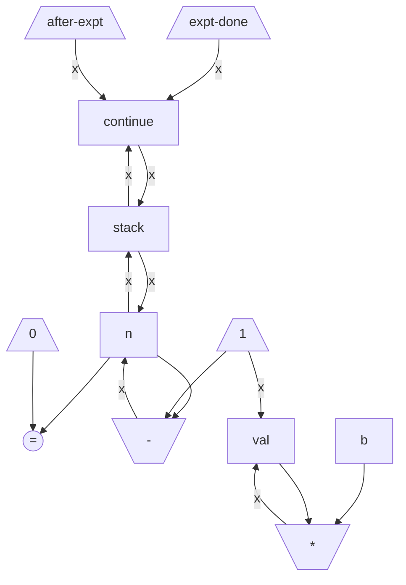
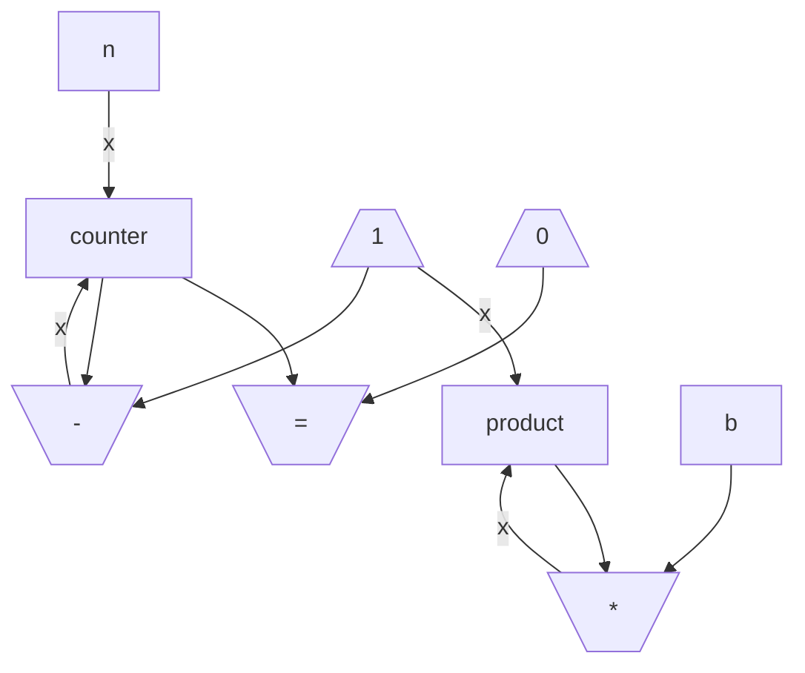

再帰的指数計算：

```mermaid
flowchart TD
  constdone[/expt-done\] -- x --> continue

  n --> opeq((=))
  constzero[/0\] --> opeq

  continue -- x --> stack
  n -- x --> stack
  n --> opsub[\-/]
  constone[/1\] --> opsub
  opsub -- x --> n
  constafterexpt[/after-expt\] -- x --> continue

  stack -- x --> n
  stack -- x --> continue
  b --> opmul[\*/]
  val --> opmul
  opmul -- x --> val

  constone -- x --> val
```

反復的指数計算：

```mermaid
flowchart TD
  n -- x --> counter
  constone[/1\] -- x --> product

  counter --> opeq[\=/]
  constzero[/0\] --> opeq

  constone --> opsub[\-/]
  counter --> opsub
  opsub -- x --> counter
  b --> opmul[\*/]
  product --> opmul
  opmul -- x --> product
```
